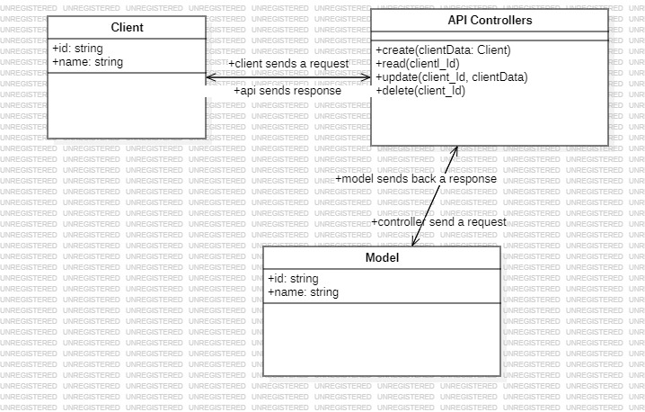

# HNG STAGE TWO TASK
This project is a simple REST API capable of performing CRUD operations on a "person" resource.  
This Api interfaces with the Postgresql database resource

## List of project dependencies
* Node/Express.js
* Typescript 
* Prisma orm
* dotenv

you can also text the live api here [apiUrl]()

## Project Setup
In order to setup and host this project locally, follow the following steps  
1. clone this repository using the  ***git clone*** command
2. Navigate to the root directory of Your project and in the terminal run ***npm install*** to install the required packages
3. Next, run ***npm run dev*** to start up the local server on *localhost:2000*

## How to query data to and from the API
This Api was developed with endpoints for

* CREATE:Adding a new person =>[ **http:localhost:2000/api**]( http:localhost:2000/api) .
    > The user name is provided in the request body: eg ***{name:username}***
    > response format: ***{id:userId,name:'username'}***

* READ:Fetching details of a person =>.The user id or user name  should be passed as a dynamic parameter in the url in order to get a particular user details
    > url format [**http:localhost:2000/api/user_id**](http:localhost:2000/api/user_id) or [**http:localhost:2000/api/username**](http:localhost:2000/api/username) 
    > response format **{id:userId,name:username}**

* UPDATE:Modifying Details of an existing person=>
url format [**http:localhost:2000/api/user_id**](http:localhost:2000/api/user_id)  or [**http:localhost:2000/api/username**](http:localhost:2000/api/user_id) 
    > request format in json **{name:username}**
    > response format **updated successfully**

* DELETE: REmoving a person=>deleting a user does not require data to be passed into the request body
    url format **http:localhost:2000/api/user_id**  or **http:localhost:2000/api/username** 

## Link to UML diagrams

## Sample uasage of the api
* Create:
  > request format: ***{name:`david`}***
  > reponse fromat: ***{id:`73589676-f979-4052-b44d-e03f342152a7`,name:`david`}***
* Read:
    > reponse fromat: ***{id:`73589676-f979-4052-b44d-e03f342152a7`,name:`david`}***
    > url fromat:***http:localhost:2000/api/73589676-f979-4052-b44d-e03f342152a7***
* Update:
    >request fromat:***{name:`david`}***
    > reponse fromat: ***updated successfully***
    > url fromat:***http:localhost:2000/api/73589676-f979-4052-b44d-e03f342152a7***
* Delete:
    > reponse fromat: ***deleted successfully***
    > url fromat:***http:localhost:2000/api/73589676-f979-4052-b44d-e03f342152a7***

## Limitations
* Api request may be a little slower than usual if user has a bad network connection
* Problems may occur when the project is not properly setup
* The UML diagram may not be accurate as I just learnt how to do it. I am currently working on improving this

## Credits
I want to appreciate everyone who has contributed to this project in any form
    